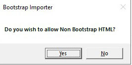
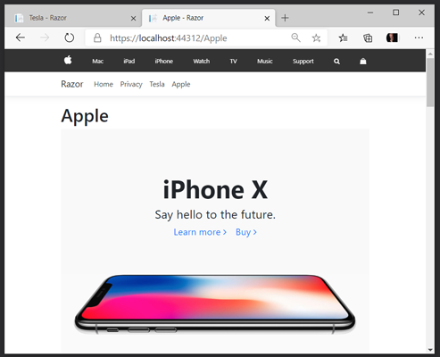

Stewart Hyde

Introduction
============

This extension is to aid in moving visual components of Bootstrap related to
HTML over to Microsoft Blazor products and in Limited fashion to Razor Pages.
This extension is an idea in connection with a 3rd party product called
Bootstrap Studio but is not limited to just that product. In the extension has
limited support for non-bootstrap pages. The extension will create Razor page,
move some resources, include separate CSS files which are important. Embedded
scripts in the body of html appears not be allowed in Razor pages and thus are
removed.

Microsoft Blazor is a wonderful platform, and I found in the limited 2 or 3
months using it, that it was making a website is easy to do. In fact, I would
say before April, I would say, except working with WordPress, that I personally
could not do it. Initially, my plan was to use WPF because of Microsoft Blend,
but with the current state of technology, I found that Blazor was a better fit.
I really like option with Blazor Web assembly to provide ASP. Net Core Hosted
option. This made creating and understand web services easier for me.

One of my things I like about WPF was the visual editing with Blend. But there
is no option with Blend and since Blazor works with Bootstrap, I search the
internet for a tool to help create Bootstrap HTML and found a product called
Bootstrap Studio and I found it was much more graphical and also that I could
export HTML and import the specific contents into Blend Razor source files. The
custom scripts and CSS can be a challenge, and I desired a way to speed up the
process. So, I desired to make an extension for Visual Studio to do the work and
provide an extension for others. I research extensions for Visual Studio and
found they were using WPF to create the ToolWindow. I figured out a way to make
the WPF screen work in both the extension and standalone project for faster
development. I found two issues with Visual Studio extensions that do not appear
to happen with same code in WPF test application which are.

1.  Initialize size of control cannot be shown, it appears to use a smaller
    size.

2.  The icon does not appear on screen and not in the menu.

Example Extension screen in Visual Studio
=========================================

The following is example screen in Visual Studio with Blazor Project loaded. By
default, the currently loaded project is loaded, and Extension will detect the
type of project that is loaded the following types of projects are detected and
acted on loaded.

1.  Blazor Server

2.  Blazor WebAssembly

3.  Blazor WebAssembly PWA

4.  Blazor Web assembly ASP.Net Core Hosted

5.  Blazor Web assembly ASP.Net Core Hosted PWA

6.  ASP.Net Razor pages

Blazor Server has best support, but for CSS Isolation to work, RenderMode must
be set to “Static” and unfortunately menu option on small screen does not work
with Static. But this is only required if different pages required different CSS
and Scripts.

Blazor Web assembly does not seem to support CSS Isolation using the technique I
am using with index.html which does not support C\# code inside it? But for
single CSS and script changes, it appears to work but background is same between
all images.

Note: So far, not able detected ASP. Net core by client only, since this primary
a Blazor product only Visual Studio 2019 is supported.

The following HTML Projects are supported

1.  Bootstrap Studio projects with some limitation with custom scripts and CSS.

2.  Bootstrap projects with limits on scripts

3.  Blazor Web assembly projects have a message and reset configuration for
    better support.

4.  Non-Bootstrap projects can be loaded with a warning message.

The idea of this extension is to give a start in migration of HTML to newer
platforms like Blazor.

You can currently access the screen from Other windows while in Visual Studio as
shown with the following screen

The following is an example of the Visual Studio screen in Visual Studio 2019
Community Edition showing Bootstrap Importer in options screen.

Commands
========

The following is a list of commands available on the extension screen.

*Load*
------

This command is used to load an HTML resource to be sparse on the system. When
you pressed the command on screen, you will be prompted by the following screen
to select the html project. This is the root directory and assume to be
index.html. You can change which file with editorial command.

A screenshot of a cell phone Description automatically generated

If you pick a non-bootstrap project such as download html–or html from another
project, the extension will be prompted with the following screen and extension
will attempt to add the specific information. But a lot of sites have embedded
scripts in body and those scripts are not allowed on Blazor/razor page.

*Preview*
---------

This command is will show a preview of what is generated with changes applied to
the project and preview will be written in the PageName_preview. text file in
the project. The command is only available, is only available if both HTML and
Visual Studio projects are valid.

*Edit HTML*
-----------

This is allowed you to change the name of HTML file from default of index.html.
This is only available if both the HTML and Visual Studio projects are valid.
This can be used in the following 2 situations.

1.  If desired html to load is different than index.html

2.  If using a shared assets access when multiple pages are used

*New*
-----

This command allows you to add new HTML project to system and only valid if both
HTML and Visual Studio projects are valid

*Details*
---------

This command allows will display additional detail information about the
configuration and will only be valid if both HTML and Visual Studio Projects are
valid. This was originally intended for more advance options, but I found it was
useful in normal actively. So, this become more of informational screen as
below.

*Select*
--------

This command allows you to select a different Visual Studio project for
generating changes on. This is normally not necessary and should use the default
loaded project. But maybe used if your solution has multiple projects within it
and will used current selected project. The following screen allows you to
change product directory.

Note, Blazor Web-assembly, does not support CSS Isolation means the CSS must be
shared between all pages. But as long as the CSS modification can function in
Index.html, it can be functionally. I included two different web assembly
examples for this reason.

*Create*
--------

This command will create changes to visual studio project with changes made by
configuration. Once changes are made you should be able to re-compile your
changes in the project. Note if HTML project comes back that it is warning, you
could get errors especially if scripts are allowed. It is best practice to make
sure that you have a backup of your projects before making changes.

*Cancel*
--------

This is basically same as X on windows and allows you exit the extension. Any
changes done with Create command will be a change in project.

Configurations
==============

The following is a list of fields, and configurations used in the extension

*Bootstrap HTML Contents*
-------------------------

This contain directory of where the extension gets information imported in for
generating Razor pages and assets used by the system. This directory is loaded
by used the Load command. This field is read only.

*Bootstrap HTML Page*
---------------------

This contains the html page which to parse for contents including assets, this
will default to index.html but can be change using the Edit command.

*Modify Option*
---------------

This combo allows you to select the modified option. This indicates what is
allowed when modifying the project contents. The available options are.

1.  Modify Project (default)

2.  Modify No Preview

3.  Modify Preview Only

*Asset Option*
--------------

This combo allows you select assets options. This indicates how assets are
handled in the generator. The following options are available.

1.  Static

2.  Static Same Index Page

3.  Share between pages

4.  Static Move only Assets

5.  Static Move only Assets on Same Index Page

6.  None

For different Bootstrap assets to work across multiple pages, RenderMode for
Blazor Server needs to be marked as static. Also, Assets could be different if
multiple pages are uses. This option allows this to be configured in two
different ways

1.  Static option where entire Asset is copy and used in project.

2.  Specific assets are moving, and Extension will attempt to adjust Razor page
    to match. This allow potential for non-bootstrap layouts to work.

There is also the ability to shared asset directory across multiple pages. This
is useful if website being imported has multiple html pages and use same
resource. In this case the main index should be marked with Static or StaticMove
and other pages mark with associated option to include option.

The following is the layout used by Bootstrap Studio tutorials and is best
layout for import

Assets

Img

Image.jpg

Image.png

..

Css

Fonts

Bootstrap

The difference between move and copy is that move only copies the directory
found in the html file during search, whereas copy will copy entire structure.
Also, movement will attempt to place content in above structure. Once inside the
structure it will also insert the page name (base one if pages are to share in
front of directory structure. For example, in case Tesla page, the img directory
will be wwwroot\\telsa\\assests\\img.

*CSS Option*
------------

This combo allows you to specify how the Extension generates CSS Option. The
following options are available.

1.  Include Https Fonts

2.  Include custom Bootstrap

3.  Include Bootstrap and Fonts

4.  Include AOS

5.  Include AOS and Https Fonts

6.  Include AOS and Bootstrap

7.  Include AOS, Bootstrap and Fonts

8.  None

For Blazor Server, the default Includes AOS, Bootstrap and Fonts

For Blazor Web assembly, the default Includes AOS and Https Fonts

*Host Option*
-------------

This combo allows you to specify how extension handle host options. The
available options are as follows:

1.  Modified Host Html

>   This is following based type of Project

\_Host.cshtml - Blazor

Index.html - Blazor Web assembly

\_Layout.cshtml - Rasor ASP.Net

1.  Preview Only

2.  None

*Script Option*
---------------

This combo allows you specific how scripts are handled by extension. The
available options are as follows:

1.  Ignore Scripts

2.  Strip Multi-Line Scripts

3.  Selected Script To Host

4.  Default of Strip Multi-Line and Script to Host

5.  None

*NavMenu Option*
----------------

This combo is used to specify how NavMenu are handled by the extension. The
available options are as follows:

1.  Add to NavMenu

2.  Preview Only

3.  None

*Page Option*
-------------

This combo allows you to specify how the page is handled by extension. This was
notice with some of Bootstrap Studio templates where Body had style on it. The
available options are:

1.  Convert Body Style Background

2.  None

*Project Contents*
------------------

This option allows you to change the RenderMode options, which only Applies for
Blazor Projects. By default, it “Static” so that CSS can be Isolated for
multiple pages. Note, if “Static” is used, the small screen menu does not appear
to work. The following options are available:

1.  Server Pre-rendered

2.  Server

3.  Static

4.  No Change

*Project Contents*
------------------

This field contains a directory of Visual Studio project that is will be used
for modifications. By default, it is the current project directory in the visual
studio. But can be changed by Select command. This field is read only.

*Project Type*
--------------

This field indicated the type of field that is loaded by in Project Contents, it
is a read-only field and one of following values

1.  Blazor Server

2.  Blazor WebAssembly

3.  Blazor WebAssembly PWA

4.  ASP.Net Razor

5.  Unknown please select

*Page*
------

This field defaults to name of Razor page that is generated also when using
static resource, this name is inserted in front of resource directory. The
default value is “Test” and should be change. This value is also use in NavMenu
that is generated.

Steps for creating examples
===========================

Initial Setup Steps
-------------------

1.  Create a Solution with BlazorServer, BlazorTeslaWasm, BlazorAppleWasmPWA,
    and Razor projects

2.  Download Both the Tesla and Apple Bootstrap Studio and export the projects
    to HTML

You can download the projects and Bootstrap Studio from
<https://bootstrapstudio.io/tutorials/>

>   I have also provided the exported HTML

1.  Make sure the Bootstrap Importer extension is installed in Visual Studio
    2019

Steps to reproduce example provided Testa and Apple on Blazor Server
--------------------------------------------------------------------

The following are steps to reproduce the provided an example with both Tesla and
Apple on Blazor Server

1.  Make sure you select BlazorServer

2.  Load the Tesla html into Bootstrap Importer solution

3.  Change the Page from Text to Tesla but leave options for example as default.

4.  Select Preview and/or Details if you desired

5.  Hit Create and Create the solution and hit ok.

6.  You can execute and verify the Tesla Page if so, desired now if you wish

7.  Load the Apple html project into Bootstrap Importer Extension

8.  Change the Page from Text to Apple but leave options for example as default.

9.  Select Preview and/or Details if you desired

10. Hit Create and Create the solution and hit ok.

11. You can execute and verify the Tesla and Apple Page are visible

12. Save the Solution.

Steps to reproduce example provided Testa on Blazor Web assembly
----------------------------------------------------------------

The following are steps to reproduce the provided an example with both Tesla on
Blazor Web assembly

1.  Make sure you select BlazorTeslaWasm project

2.  Load the Tesla html into Bootstrap Importer solution

3.  Change the Page from Text to Tesla but leave options for example as default.

4.  Select Preview and/or Details if you desired

5.  Hit Create and Create the solution and hit ok.

6.  You can execute and verify the Tesla Page

7.  Save the Solution

Steps to reproduce example provided Apple on Blazor Web assembly PWA
--------------------------------------------------------------------

The following are steps to reproduce the provided an example with both Apple on
Blazor Web assembly PWA

1.  Make sure you select BlazorAppleWasmPWA project

2.  Load the Apple html into Bootstrap Importer solution

3.  Change the Page from Text to Apple but leave options for example as default.

4.  Select Preview and/or Details if you desired

5.  Hit Create and Create the solution and hit ok.

6.  You can execute and verify the Apple Page

7.  Save the Solution

Steps to reproduce example provided Testa and Apple on Blazor Server
--------------------------------------------------------------------

The following are steps to reproduce the provided an example with both Tesla and
Apple on ASP.Net Razor

1.  Make sure you select Razor Project

2.  Load the Tesla html into Bootstrap Importer solution

3.  Change the Page from Text to Tesla but leave options for example as default.

4.  Select Preview and/or Details if you desired

5.  Hit Create and Create the solution and hit ok.

6.  You can execute and verify the Tesla Page if so, desired now if you wish

7.  Save the Solution

8.  Load the Apple html project into Bootstrap Importer Extension

9.  Change the Page from Text to Apple but leave options for example as default.

10. Select Preview and/or Details if you desired

11. Hit Create and Create the solution and hit ok.

12. You can execute and verify the Tesla and Apple Page are visible

13. Save the Solution.

Example Screen Shot
===================

Blazor Server with Tesla page

Blazer Server with Apple page

Blazer Web Assembly with Tesla website

Main Blazor Page showing problem with CSS isolation issue

Blazor Web Assembly PWA as PWA

Blazor Web Assembly PWA reduce with Phone like menu

And without menu

Razor Page showing Tesla

Razor Page showing Apple Page

Future Enhancements
===================

1.  Support for updating previous Razor NavMenu when more than one used

2.  Improved File IO – currently uses external and would like generic it and
    allow Visual Studio IO.

3.  Improved support for Non-Bootstrap HTML and addition Bootstrap abilities.

4.  Options to handle back up existing files while processing.

5.  Blazor server needs Render Mode to be static and small screen does not work

Mostly this will allow developer a starting point when import Bootstrap HTML
