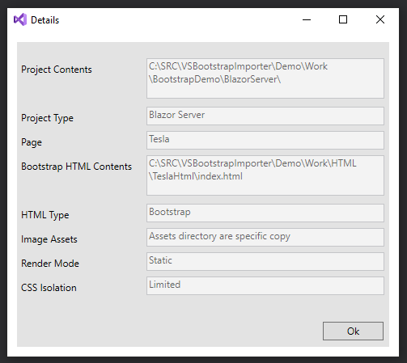

---
title: Bootstrap Importer Extension Source
---

Stewart Hyde

Introduction
============

This extension is to aid in moving visual components of Bootstrap related to
HTML over to Microsoft Blazor products and in Limited fashion to Razor Pages.
This extension is an idea in connection with a 3rd party product called
Bootstrap Studio but is not limited to just that product. In the extension has
limited support for non-bootstrap pages. The extension will create Razor page,
move some resources, include separate CSS files which are important. Embedded
scripts in the body of html appears not be allowed in Razor pages and thus are
removed.

The extension is available on Visual Studio Marketplace and this GitHub provides 
source for extension and support code.  Included is WPF test application that use 
same logic as the extension plus Unit Testing including memory based Generator 
testings for the 4 project types and specific units in the common modules.  
The following of layout of modules included

VSBootstrapImporter 			- Actual code for Extension specific logic 
VSBootstrapImporter.Common		- Common logic for Dialogs and Generator
WPFNetbootstrap				- WPF standalone application for Importer
VSBootstrapImporter.Tests		- MSBase unit testing for importer
VSBootstrapImport.SetupExpected 	= Command Line application that generates in 
					  memory test data for contain in files.cs 
 					  used for generator unit testing.


The following is example screen that is can be generated without any source code
modification.



The following is visual studio dialog with options for generating the necessary
code. Note this is not just limited to Bootstrap or Bootstrap Studio but results
may not compile especially dealing with scripts.



The following is a more detail document that includes instructions and more
examples on using the extension.

[Boottrap Importer](BootstrapImporter.md)

You can download the projects and Bootstrap Studio from
<https://bootstrapstudio.io/tutorials/>

I hope you enjoy this extension and it primary use to show what is possible with
attempts to isolated CSS in Blazor and even older Razor projects and to fill the
gap of visual interface using Bootstrap Studio.

Source Code Layout Assumptions - mostly for Unit Testing 






Stewart Hyde



